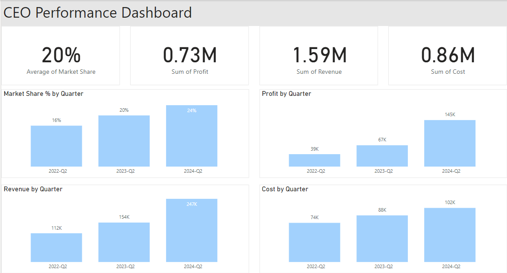

# eCommerce Fashion Dashboards

## CEO

### 6 Thinking Hats
1. **White Hat (Facts and Information)**:
   - Look at the numbers on your dashboard. These are the facts and figures about your company's performance.
   - What do the numbers say about how much money your company is making and spending? Are the numbers going up or down?

2. **Red Hat (Feelings and Emotions)**:
   - Think about how you feel when you see these numbers. Are you happy because your company is making more money? Or are you worried because costs are going up?

3. **Yellow Hat (Positives and Benefits)**:
   - Focus on the good things. Are there any positive signs in the numbers? Maybe your revenue is growing or your employees are happy. These are the things to be happy about!

4. **Black Hat (Negatives and Problems)**:
   - Now, let's look at the challenges. Are there any problems or concerns in the numbers? Maybe costs are too high or customer satisfaction is low. These are the things we need to work on.

5. **Green Hat (Creativity and Ideas)**:
   - Time to think outside the box! What can we do to improve the numbers? Maybe we can come up with new ideas to increase revenue or reduce costs. Let's brainstorm and get creative!

6. **Blue Hat (Big Picture and Planning)**:
   - Step back and look at the overall picture. What are our long-term goals? How can we use these numbers to help us achieve them? Let's make a plan to move forward and reach our targets.

### The metrics are needed by the CEO for several important reasons:

1. **Tracking Progress**: The metrics help the CEO track the progress of the company towards its overarching goals of increasing revenue, reducing costs, and ultimately increasing profits. By monitoring these metrics, the CEO can see if the company is moving in the right direction or if adjustments need to be made.

2. **Strategic Decision Making**: The metrics provide valuable data for strategic decision-making. For example, if overall revenue growth is stagnating, the CEO may need to rethink the company's sales and marketing strategies. If employee engagement is low, the CEO may need to focus on improving company culture and morale.

3. **Performance Evaluation**: The metrics serve as key performance indicators (KPIs) that allow the CEO to evaluate the performance of different departments, teams, and individuals within the organization. This helps in identifying areas of strength and areas that need improvement.

4. **Alignment with Company Goals**: The metrics ensure that the entire organization is aligned with the company's overarching goals. By setting KPIs related to revenue growth, market share, employee engagement, and customer satisfaction, the CEO communicates the company's priorities and ensures that everyone is working towards the same objectives.

### Getting this information on a regular basis can vary in difficulty depending on several factors:

1. **Data Availability**: The CEO's ability to access this information depends on the availability and reliability of data within the organization. If the necessary data is readily available and well-organized, it can be relatively easy to retrieve and analyze.

2. **Data Integration**: In many organizations, data is stored in various systems and databases across different departments. Integrating this data into a unified dashboard or reporting system can be challenging and may require significant effort from IT and data teams.

3. **Data Quality**: Ensuring the accuracy and quality of the data is crucial for making informed decisions. Poor data quality can lead to incorrect conclusions and ineffective decision-making. The CEO may need to invest time and resources into data cleansing and validation processes.

4. **Reporting Tools and Processes**: The CEO may rely on reporting tools and processes to access and analyze the necessary information. The complexity and usability of these tools can affect the ease with which the CEO can obtain the required insights.

5. **Time Constraints**: The CEO's busy schedule and other responsibilities may limit the amount of time they can dedicate to reviewing and analyzing data. Having efficient processes and streamlined reporting mechanisms can help mitigate this challenge.
