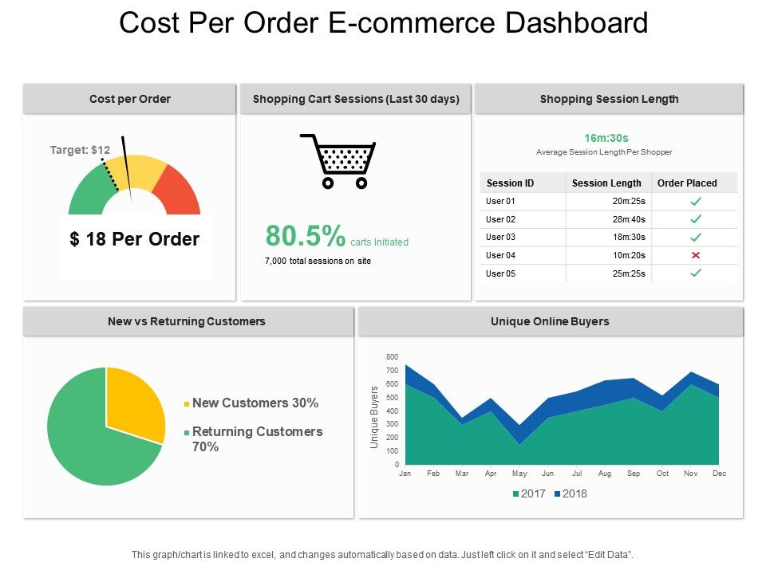
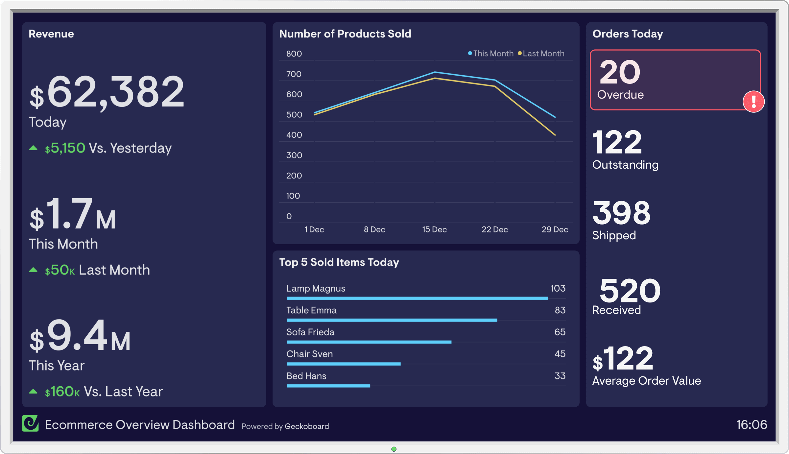

# eCommerce

# Steps to Execute
- Step 1 : Manully Replicate Dashboard
- Step 2 : Create Metrics with Data (Create whichever Possible)

## Idea 1

## Idea 2

## Idea 3

## Idea 4

## Idea 5

## Idea 6

## Idea 7

## Idea 8

## Idea 9

## Idea 10

